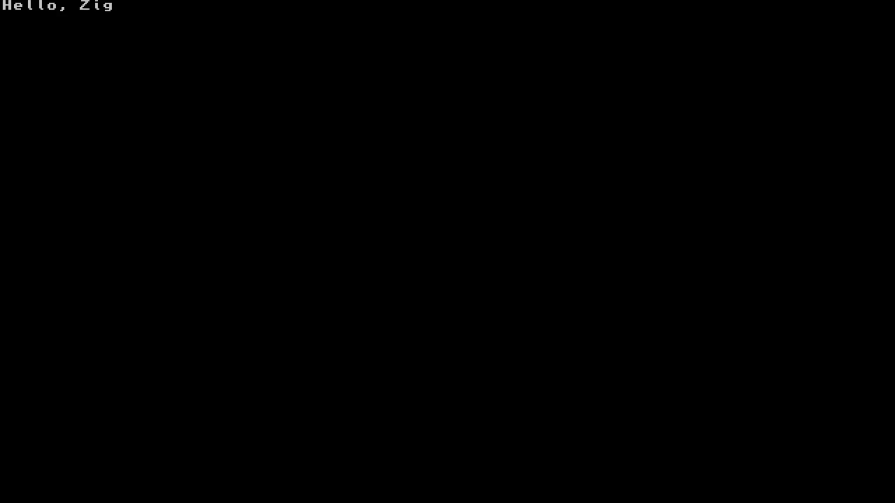

# zig-switch



## Getting started

- [zig](https://ziglang.org/download/)
- [devkitPro](https://devkitpro.org/wiki/Getting_Started)

```
pacman -S switch-dev
git clone https://github.com/zig-homebrew/zig-switch
cd zig-switch/
zig build # then run zig-out/zig-switch.nro with ryujinx
```

## Resources

- [switch-examples](https://github.com/switchbrew/switch-examples)
- [libnx repository](https://github.com/switchbrew/libnx)
- [libgba documentation](https://switchbrew.github.io/libnx/files.html)
